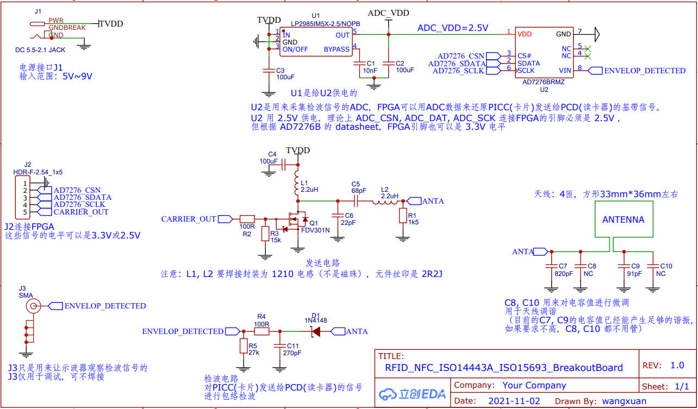
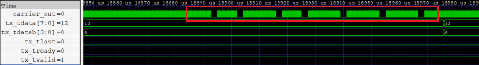

-CAD09D.svg)   

FPGA NFC (RFID)
===========================

用 FPGA 从底层开始搭建一个 NFC PCD (读卡器)，支持 ISO14443A 标准。

## 为什么要做本项目？

本人想玩玩射频，又想展示一些和其它玩 SDR 的人不一样的东西。然后发现 NFC 的载波频率只有 13.56MHz，且调制方式为调幅（ASK） ，可以用很低的成本（最廉价的 FPGA + 1个3Msps 的ADC + 几个分立器件）实现一个读卡器。FPGA内既进行数字信号处理，又进行协议处理，是一个完整的~~可以装X的~~小系统。于是就有了本项目，它能在 PC 端串口命令控制下，完整地支持 ISO14443A 。并成功地与 M1卡 交互。

## 名词释义

| 名词                      | 简称 | 直观名称               | 释义                                                         |
| ------------------------- | ---- | ---------------------- | ------------------------------------------------------------ |
| Proximity Coupling Device | PCD  | 读卡器、读写器、Reader | 给卡片提供能量，并作为通讯主机的设备，其实就是读卡器，也就是本项目要实现的东西。 |
| Proximity Card            | PICC | 标签、卡片、TAG        | M1卡、UID卡、电子标签这些卡片。不同类的卡片可能满足不同标准。 |
| PCD-to-PICC               | TX   | 发送                   | PCD 对载波进行调制，传输信息到 PICC                          |
| PICC-to-PCD               | RX   | 接收                   | PICC 改变自身阻抗，使得 PCD 探测到载波幅度发生变化，从而传输信息到 PCD 。 |
| NXP MIFARE Classic 1K     | M1卡 |                        | 一种满足 ISO14443A 的卡片，日常生活很常见，比如门禁卡。      |
| ISO14443A                 | NFCA |                        | 一种 NFC 标准，用于个人卡片。本项目从硬件到协议完全支持。详见 [1,2,3] |
| ISO14443B                 | NFCB |                        | 一种 NFC 标准，用于个人卡片。本项目硬件不支持。详见 [1,2,3]  |
| ISO15693                  | NFCV |                        | 一种 NFC 标准，用于工业电子标签。本项目硬件支持，但 FPGA 尚未编写其协议。详见 [1,2] |
| Carrier、载波             | fc   | 13.56MHz 载波          | FPGA 发射引脚需要产生的频率，驱动线圈在这个频率下谐振。      |
| Subcarrier、副载波        | fs   | 847.5 kHz 副载波       | 调制的最小单位（PCD和PICC会以这个频率改变调制幅度），是载波频率的 1/16 |
| 位频率                    |      | 105.9375 kHz           | 8个副载波周期可能携带一位 (bit) 数据信息                     |
| Amplitude Shift Keying    | ASK  | 调幅                   | 通过改变载波幅度来传送信息                                   |

更多简称详见引用 [1,2,3]

## 项目思路

首先是载波生成，我们用 FPGA 的引脚产生 13.56MHz 的信号（对应代码文件 nfca_tx_modulate.sv），该信号驱动一个 MOS 管 (FDV301N) + 一个谐振电路来让天线(线圈)谐振。

其次是载波调制发送，ISO14443A 的 PCD-to-PICC 的副载波调制方式是 100% ASK （即在一个副载波周期内，要么满幅度发送载波，要么完全不发送载波），这对 FPGA 也是很容易实现的（对应代码文件 nfca_tx_modulate.sv）。

然后是接收卡片的调制信息，PICC-to-PCD 的调制方式是 2%~10% 的 ASK （即在一个副载波周期内，要么让载波衰减一点，要么不衰减）。我用二极管(1N4148)+电容+电阻来做包络检波，得到包络线的频率=副载波频率=847.5kHz，然后用 ADC 对包络线采样（对应代码文件 ad7276_read.sv）。包络检波降低了 ADC 采样率的需求，避免直接使用 ≥20Msps 的 ADC 来采样载波，而是只用一个 3Msps 的 ADC (AD7276B) 来采样副载波即可。在 FPGA 内，用一个数字信号处理(DSP)算法来从 ADC 采样数据中检测 PICC-to-PCD 的 ASK 信号，即检测 ADC 采样数据幅度的微小变化，需要有抗噪声能力，并自适应信号幅度。我用的是中值滤波减去原始信号，再做比例阈值判断，效果不错（对应代码文件 nfca_rx_dsp.sv）。

最后是实现 ISO14443A 的编解码协议，包括发送校验生成和封包（对应代码文件 nfca_tx_frame.sv）、接收协议的解包（对应代码文件 nfca_rx_tobits.sv 和 nfca_rx_tobytes.sv），这部分是按照 Spec 文档  [3] 编写的。

我还在 FPGA 中实现了串口控制逻辑，将 Host-PC 发送给 FPGA 的串口命令解析成 NFC 发送数据（对应代码文件 uart_rx.sv 和 uart_rx_parser.sv），并将 NFC 接收数据通过串口发送给 Host-PC （对应代码文件 uart_tx.sv）。用户可以在 Host-PC 的”串口调试工具“中发送数据给卡片，然后收到卡片返回的数据。

下图是系统框图，其中 FPGA 中的模块下方逐个标注了 Verilog 代码文件名。

    _________   _________________________________________________________________________________________________________
            |   |  ___________________________________________________________________________________________________  |
            |   |  |                       _________________________________________________________                 |  |
            |   |  |         ___________   |    ____________          _____________                |                 |  |   ____________    ____________
            |   |  | uart_rx | UART RX |   |    |  frame   |          | RFID TX   |                |                 |  |   | FDV301N  |    | Resonant |      ___________
    uart_tx |---|->|-------->|  logic  |---|--->|  pack    |--------->| modulate  |--------------->|---------------->|--|-->| N-MOSFET |--->| circuit  |      |         |
            |   |  |         -----------   |    ------------          -------------                |   carrier_out   |  |   |          |    |          |---v->| Antenna |
            |   |  |           uart_rx.sv  | nfca_tx_frame.sv           | nfca_tx_modulate.sv      |                 |  |   ------------    ------------   |  |  Coil   |
            |   |  |    uart_rx_parser.sv  |                    rx_rstn |                          |                 |  |                                  |  |         |
            |   |  |  stream_sync_fifo.sv  |                            |                          |                 |  |                                  |  -----------
            |   |  |         ___________   |  ___________         ______V____        ____________  |  _____________  |  |     ___________   ____________   |
            |   |  | uart_tx | UART TX |   |  | bytes   |         | bits    |        | ADC data |  |  | AD7276B   |  |  |     | AD7276B |   | Envelop  |   |
    uart_rx |<--|--|<--------|  logic  |<--|--| rebuild |<--------| rebuild |<-------| DSP      |<-|--|ADC reader |<-|<-|-----|   ADC   |<--| detection|<---
            |   |  |         -----------   |  -----------         -----------        ------------  |  -------------  |  | SPI |         |   |          |
            |   |  |          uart_tx.sv   |nfca_rx_tobytes.sv   nfca_rx_tobits.sv  nfca_rx_dsp.sv |  ad7276_read.sv |  |     -----------   ------------
        GND |---|  |                       --------------------------------------------------------|                 |  |
            |   |  |                                      nfca_controller.sv                                         |  |
            |   |  ---------------------------------------------------------------------------------------------------  |
            |   |                                    uart2nfca_system_top.sv                                            |
    ---------    --------------------------------------------------------------------------------------------------------
     Host-PC                                               FPGA (fpga_top.sv)                                                       Analog Circuit

# 硬件

PCB 文件夹里是本库的硬件设计（命名为 NFC_BreakoutBoard），上面主要包括：

- 发送电路： N-MOSFET、电感等。
- 接收电路：检波二极管、AD7276B。
- 4匝线圈。

|  |
| :----------------------------------: |
|    图： NFC_BreakoutBoard 原理图     |

请用制造文件 NFC_BreakoutBoard_gerber.zip 来打样 PCB ，然后焊接元件。

硬件连接方法：

- J1 连接 5V~9V 的电源。
- J2 连接 FPGA 开发板（占用 FPGA 4 个普通 IO 引脚，电平为 3.3V 或 2.5V 均可）。注意：ADC_SCK 的频率高达 40.68MHz，因此不建议用杜邦线，而是用排针直插到 FPGA 开发板。

该 PCB 设计在立创 EDA 开源： [oshwhub.com/wangxuan/rfid_nfc_iso14443a_iso15693_breakoutboard](https://oshwhub.com/wangxuan/rfid_nfc_iso14443a_iso15693_breakoutboard)

# FPGA 部署

部署到 FPGA 时，所有 RTL/ 目录 和 RTL/nfca_controller/ 目录 中的 .sv 文件都需要加入工程。FPGA 顶层为 fpga_top.sv 。它的每个引脚的连接方式见代码注释，如下：

    module fpga_top(
        input  wire        rstn_btn,        // press button to reset, pressed=0, unpressed=1
        input  wire        clk50m,          // a 50MHz Crystal oscillator
        
        // AD7276 ADC SPI interface
        output wire        ad7276_csn,      // connect to AD7276's CSN   (NFC_Breakboard's AD7276_CSN)
        output wire        ad7276_sclk,     // connect to AD7276's SCLK  (NFC_Breakboard's AD7276_SCLK)
        input  wire        ad7276_sdata,    // connect to AD7276's SDATA (NFC_Breakboard's AD7276_SDATA)
        
        // NFC carrier generation signal
        output wire        carrier_out,     // connect to FDV301N(N-MOSFET)'s gate (栅极)  (NFC_Breakboard's CARRIER_OUT)
        
        // connect to Host-PC (typically via a USB-to-UART chip on FPGA board, such as FT232, CP2102 or CH340)
        input  wire        uart_rx,         // connect to USB-to-UART chip's UART-TX
        output wire        uart_tx,         // connect to USB-to-UART chip's UART-RX
        
        // connect to on-board LED's (optional)
        output wire        led0,            // led0=1 indicates PLL is normally run
        output wire        led1,            // led1=1 indicates carrier is on
        output wire        led2             // led2=1 indicates PCD-to-PICC communication is done, and PCD is waiting for PICC-to-PCD
    );

* 所有代码都是 SystemVerilog 行为级实现，支持任意 FPGA 平台。
* 除了 fpga_top.sv 里的 altpll 模块是仅限于 Cyclone IV E 的原语，它用来生成 81.36MHz 时钟，驱动 NFC 控制器。如果你用的不是 Altera Cyclone IV E，请使用其它的 IP 核（例如Xilinx 的 clock wizard）或原语来替换。

# 串口控制

Host-PC 通过串口控制 FPGA 和 PICC 进行交互。串口格式为 9600,8,n,1 (即波特率=9600，8个数据位，无校验位，1个停止位)。串口通信是“一问一答”的形式，发送你要发给卡片的数据，然后卡片返回数据。每个命令和响应都以 \r 或 \n 或 \r\n 结尾（也就是一行一个命令/响应）

首先，建议在 PC 上使用“串口调试助手”，而不是 putty 等软件。因为我设计的逻辑是： FPGA 会在收到串口命令时打开载波，如果1.2秒内没有下一个命令到来，就自动关闭载波。这对于一个控制串口的应用程序是足够的时间。但1.2秒是不够人是打出下一条命令的，会导致载波关闭，卡片下电，卡片之前获得的状态都消失了。“串口调试助手”可以一次发送多行命令，而 Putty 则一次只能打一条命令。

> 注意：“串口调试助手” 往往有“16进制显示”和“16进制发送”选项，不需要勾选。本项目里 FPGA 会把收到的 ASCII 的十六进制形式处理成数字，也会把发出的 数字转成 ASCII 十六进制形式。

## 与 M1 卡通信

我用自己的门禁卡，和几个在 taobao 上买了的 M1 “白卡”试了试，因为都是 M1 卡，行为类似。以一个卡举例：

在 “串口调试助手” 中输入如下命令并点击发送，这会发送 0x26（ISO14443 [3] 规定的 REQA）给卡片（注意末尾要加回车，这样才会被当成一条完整的命令）：

    26

然后串口收到如下，这是 ISO14443 规定的 ATQA，含义是 Bit frame anticollision 。

    04 00

> **注：如果没检测到卡，或者因噪声干扰而收到不符合标准规定的波形，串口的行尾会收到字符 n。表示： FPGA正常工作，但没检测到卡/出现错误。**

然后我们在“发送框”里下一行附加一个  ISO14443 规定的 AntiCollision 命令，用来获得卡的 UID （因为很可能1.2秒已经过去了，卡片已经丢失了上次上电的信息，需要重新发送 REQA 0x26）。

    26
    93 20

卡片响应如下（第一行是响应 REQA 的 ATQA，第二行是 响应 anticollision 的 UID）：

    04 00
    4B BE DE 79 52

然后我们在“发送框”里下一行附加一个 ISO14443 规定的 SELECT 命令，用刚刚获取到的 UID 选中该卡：

    26
    93 20
    93 70 4B BE DE 79 52

卡响应 ISO14443 规定的 SAK=0x08（代表它是 M1 卡。后面的 0xB6 0xDD 则是 CRC 校验码）：

    04 00
    4B BE DE 79 52
    08 B6 DD

> **注：发送时不需要用户附加 CRC 校验码， FPGA 会在协议规定的需要加校验码的地方自动计算并追加 CRC。**
>
> **注：接收时，CRC 码不会被 FPGA 检查和删掉，会从串口展示出来。**

根据卡片返回的 SAK ，知道这是 M1 卡后，我们可以发送 M1 卡的 Key 认证命令的 Phase1 （第一阶段），从卡片获取随机数（注意，该命令不是 ISO14443 规定的，而是 M1 卡独有的，其它卡不会响应这个命令）。我们在“发送框”里下一行附加：

    26
    93 20
    93 70 4B BE DE 79 52
    60 07

卡片响应 4 字节随机数：

    04 00
    4B BE DE 79 52
    08 B6 DD
    EF 9B B6 5A

M1 卡的后续认证、读写步骤很复杂，不是本工程关注的范围。本工程仅关注 ISO14443A PCD 与 PICC 交互的底层实现。你可以用上层应用程序（C, Python, C# 编程）控制串口来进行 M1 卡的进一步操作。

## 测试 AntiCollision 

AntiCollision 是 ISO14443 规定的多卡检测和防冲突机制，因为不同的卡拥有不同的 UID，读卡器用 UID 来区分不同的卡。

我把 2 张 M1 卡放在线圈上，串口发送 REQA 和 AntiCollision 命令，试图获取卡的 UID：

    26
    93 20 

串口收到：

    04 00
    01:1

01:1 的含义是一个不完整的字节 0x01（00000001），:1 代表该冲突发生在该字节的从低到高第1位。

这说明，这两个卡的 UID 的第一个字节的低2位分别是 01 和 11。第0位一样所以没发生冲突，第1位不一样所以发生了冲突。

现在你想选择低2位是 11 的那个卡，就需要发送 ISO14443 规定的 bit-oriented 帧，这种帧的最后一个字节是不完整的。用串口发送：

    26
    93 20
    93 22 03:2

93 22 03:2 是一个 bit-oriented 帧。 22 代表：读卡器额外指定 UID 中的 2 个 bit，满足的卡才会响应，不满足的卡就不要响应。后面的 03:2 代表只发送 0x03 (00000011) 的低2位，即 11 。

串口收到：

    04 00
    01:1
    48 BE DE 79 52

最后一条响应是 48 BE DE 79 52 ，注意，48 并不是一个完整字节，它只有高6bit有效，他还需要拼接上低2bit（即0x03的低2bit），才是完整的字节。

一个简单的拼接方法是将读卡器发送的不完整字节 0x03 和卡片返回的不完整字节 0x48 进行按位或，得到 0x4B。

表明这张卡的 UID = 4B BE DE 79 52。

同理，如果想选择低2位是 01 的那个卡，就需要串口发送：

    26
    93 20
    93 22 01:2

串口收到：

    04 00
    01:1
    00 1D DD 79 B8

将读卡器发送的不完整字节 0x01 和卡片返回的不完整字节 0x00 进行按位或，得到 0x01。

表明另一张卡的 UID = 01 1D DD 79 B8。

如果卡的数量有3张以上，依照这个流程还可能发生多次冲突，每发生一次冲突都要指定你要选择发生冲突的那一位=0的卡，还是=1的卡。

## 逐位 AntiCollision 的例子

为了方便大家加深对 ISO14443 的 AntiCollision 过程的理解，下面我们展示一个逐位 AntiCollision 的例子，用串口发送如下这些命令，每条命令都只多指定一位。

    26
    93 20
    93 21 01:1
    93 22 01:2
    93 23 01:3
    93 24 01:4
    93 25 01:5
    93 26 01:6
    93 27 01:7
    93 30 01
    93 31 01 01:1
    93 32 01 01:2
    93 33 01 05:3
    93 34 01 0D:4
    93 35 01 1D:5
    93 36 01 1D:6
    93 37 01 1D:7
    93 40 01 1D 
    93 41 01 1D 01:1
    93 42 01 1D 01:2
    93 43 01 1D 05:3
    93 44 01 1D 0D:4
    93 45 01 1D 1D:5
    93 46 01 1D 1D:6
    93 47 01 1D 5D:7
    93 50 01 1D DD 
    93 51 01 1D DD 01:1
    93 52 01 1D DD 01:2
    93 53 01 1D DD 01:3
    93 54 01 1D DD 09:4
    93 55 01 1D DD 19:5
    93 56 01 1D DD 39:6
    93 57 01 1D DD 79:7
    93 60 01 1D DD 79
    93 61 01 1D DD 79 00:1
    93 62 01 1D DD 79 00:2
    93 63 01 1D DD 79 00:3
    93 64 01 1D DD 79 08:4
    93 65 01 1D DD 79 18:5
    93 66 01 1D DD 79 38:6
    93 67 01 1D DD 79 38:7

串口收到：

    04 00
    01 1D DD 79 B8
    00 1D DD 79 B8
    00 1D DD 79 B8
    00 1D DD 79 B8
    00 1D DD 79 B8
    00 1D DD 79 B8
    00 1D DD 79 B8
    00 1D DD 79 B8
    1D DD 79 B8
    1C DD 79 B8
    1C DD 79 B8
    18 DD 79 B8
    10 DD 79 B8
    00 DD 79 B8
    00 DD 79 B8
    00 DD 79 B8
    DD 79 B8
    DC 79 B8
    DC 79 B8
    D8 79 B8
    D0 79 B8
    C0 79 B8
    C0 79 B8
    80 79 B8
    79 B8
    78 B8
    78 B8
    78 B8
    70 B8
    60 B8
    40 B8
    00 B8
    B8
    B8
    B8
    B8
    B0
    A0
    80
    80

~~读卡器：你这每一位都保响应吗？~~

~~卡片：瞧瞧你附近哪儿有那么多卡啊？这都是近场的通信，你想防冲突我还没必要防冲突呢。~~

~~读卡器：我问你你每一位都保响应吗？~~

~~卡片：你是故意找茬是不是？你 SELECT 不 SELECT 吧！~~

~~读卡器：你要每一位都正确响应我肯定 SELECT 啊。~~

~~读卡器：那他要是不响应呢？~~

~~卡片：不响应，我免认证让你读写，满意了吧？~~

~~卡片：00 1D DD 79 B8，无冲突。~~

~~读卡器：93 22 01:2，剩下 38 bit 响应给我看看。~~

~~卡片：你是故意找茬是不是！你 SELECT 不 SELECT 吧！~~

# 调试

如果你将卡放在线圈上，并发送串口命令后，串口响应不符合预期，应该：

- 看看串口是否响应字符 'n'，若没有，说明 FPGA 工作不正常。检查串口连接和波特率设置，并看看程序有没有烧到 FPGA 里。
- 如果无论发什么，都响应字符 'n' ，说明 FPGA 正常工作，但没检测到卡。请检查 NFC_BreakoutBoard 的电源、FPGA 和 NFC_BreakoutBoard 的连接和引脚分配。如果没问题，将卡贴在线圈上保证信号强度。
- 如果还不行，进一步的调试方法是用示波器观察信号，将示波器接在 NFC_BreakoutBoard 的 J3 (SMA 接口上)，这里应该能观察到对载波的包络检波。让串口每隔2秒发送一次 26 (REQA)，在示波器上应该能看到载波启动、调制 0x26 的调制过程。然后观察发送调制后大概 8us 后是否有微弱的信号变化（大概只会有几十 mV的浮动），这就是卡片对读卡器的响应。

# 仿真

仿真所需要的文件在目录 SIM 里，其中：

- tb_nfca_controller.sv 是针对 nfca_controller.sv 的 testbench 。
- tb_nfca_controller_run_iverilog.bat 包含了 iverilog 仿真命令。

该仿真的行为是：向 nfca_controller 的发送接口发送一些帧，在 carrier_out 信号上可以看到调制的 PCD-to-PICC 发送数据。但该仿真并不会仿真 PICC-to-PCD ，因为我没有编写 PICC 的 model 代码。

使用 iverilog 进行仿真前，需要安装 iverilog ，见：[iverilog_usage](https://github.com/WangXuan95/WangXuan95/blob/main/iverilog_usage/iverilog_usage.md)

然后双击 tb_nfca_controller_run_iverilog.bat 运行仿真，然后可以打开生成的 dump.vcd 文件查看波形。下图是看到的 0x26（REQA）帧的调制波形：

|                          |
| :-----------------------------------------: |
| 图：仿真中看到的 0x26（REQA）帧的调制波形。 |

# 引用

* [1] ST TN1216 Technical note, ST NFC guide, https://www.st.com/resource/en/technical_note/dm00190233-st25-nfc-guide-stmicroelectronics.pdf
* [2] ISO/NFC Standards and Specifications Overview, https://e2e.ti.com/cfs-file/__key/communityserver-discussions-components-files/667/2072.ISO_5F00_NFC-Standards-and-Specifications-Overview_5F00_2014.pdf
* [3] ISO/IEC STANDARD 14443-3, http://emutag.com/iso/14443-3.pdf
* [4] THM3060 读卡器 原理图（好像没有官方公开，~~国内公司老毛病了~~。可以上 baidu 搜，或 taobao 买个模块，商家就给你原理图了）

