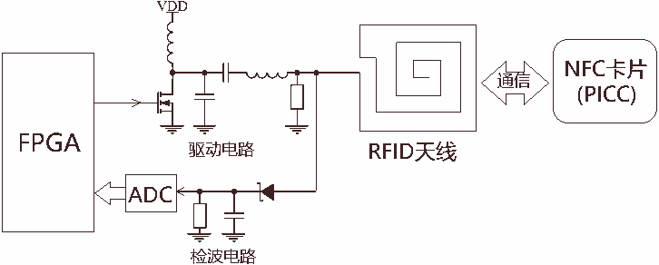
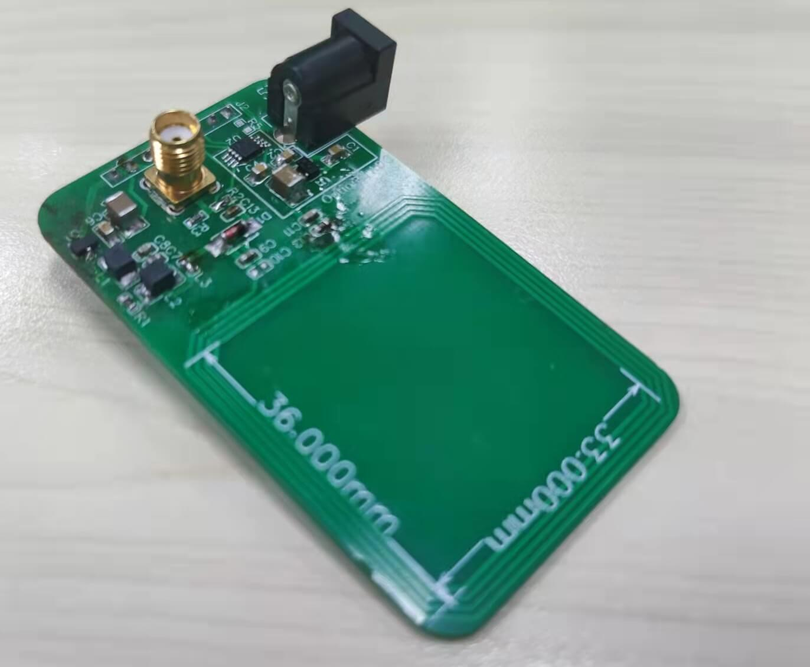

-9A90FD.svg)   

[English](#en) | [中文](#cn)

　

<span id="en">FPGA NFC (RFID)</span>
===========================

Use FPGA to build an NFC PCD (card reader) from discrete components to protocol layer, supporting the ISO14443A standard.



　

## Why?

I want to play with Radio Freqency (RF), and show something different from others who play SDR. Then I find that the carrier frequency of NFC is only 13.56MHz, and the modulation method is amplitude modulation (ASK), which can realize a card reader with very low cost (the cheapest FPGA + 3Msps ADC + several discrete components). Both digital signal processing and protocol processing are performed in the FPGA, which is a complete small system. So here comes this project, which can fully support ISO14443A under the control of the serial port commands, and has successfully interacted with the M1 card.

　

## Concept Definition

| concept                   | short name      | introduction                                                 |
| ------------------------- | --------------- | ------------------------------------------------------------ |
| Proximity Coupling Device | PCD, reader     | Provides energy to PICC and acts as a communication host, which is what this project wants to implement using FPGA. |
| Proximity Card            | PICC, card, tag | These cards such as M1 card, UID card, electronic tag and so on. |
| PCD-to-PICC               | TX, send        | PCD modulates the carrier to send information to the PICC.   |
| PICC-to-PCD               | RX, receive     | PICC changes its impedance, so that the PCD can detect changes of carrier amplitude to receive information from PICC. |
| NXP MIFARE Classic 1K     | M1 card         | A type of card that meets ISO14443A, which is very common in daily life, such as door control cards. |
| ISO14443A                 | NFCA            | An NFC standard for personal cards. This project fully supports it from hardware to protocol. See [1,2,3] for details. |
| ISO14443B                 | NFCB            | An NFC standard for personal cards. This project do not support its hardware. |
| ISO15693                  | NFCV            | An NFC standard for industrial electronic tags. This project supports its hardware, but I haven't write its protocol in FPGA. |
| Carrier                   | fc              | 13.56MHz, the drive coil of PCD resonates at this frequency. |
| Subcarrier                | fs              | The smallest unit of modulation, that is, PCD and PICC will change the carrier amplitude at this frequency, 847.5 kHz, which is 1/16 of the carrier frequency. |
| bit rate                  |                 | 8 subcarrier cycles may carry one bit, so bit rate is 105.9375 kHz |
| Amplitude Shift Keying    | ASK             | carry information by changing the amplitude of the carrier.  |

　

## Poject ideas

The 1st step is carrier generation. I use an FPGA pin to generate a 13.56MHz signal, which drives a resonant circuit by a MOSFET (FDV301N). Corresponding to the source file nfca_tx_modulate.v

The 2nd step is the implementation of PCD-to-PICC (sub-carrier modulation). The modulation method of ISO14443A's PCD-to-PICC is 100% ASK (that is, in a sub-carrier cycle, either the carrier is sent at full amplitude, or the carrier is not sent at all), which is also very easy for FPGA. Corresponding to the source file nfca_tx_modulate.v.

The 3rd step is the implementation of PCD-to-PICC-to-PCD. The modulation method of PICC-to-PCD is 2%~10% ASK (that is, in a subcarrier cycle, the carrier is either attenuated a little or not attenuated). I use a diode (1N4148), a capacitor, and a resistor for envelope detection, obtain the frequency of envelope=subcarrier frequency=847.5kHz, and then use an ADC to sample this envelope (corresponding to the source file ad7276_read.v). Envelope detection reduces the requirement for ADC sampling rate, avoiding directly sample the carrier with an ADC ≥ 20Msps, but only using a 3Msps ADC (AD7276B) to sample the subcarrier. In the FPGA, a digital signal processing (DSP) algorithm is used to detect the ASK signal of the PICC-to-PCD from the ADC sampling data, that is, to detect the small change of the ADC sampling data amplitude, which requires anti-noise capability and adaptive signal amplitude. I use median filtering to subtract the original signal, and then do proportional threshold judgment, the effect is good enough. corresponding to the source file nfca_rx_dsp.v.

The last step is to implement the codec protocol of ISO14443A, including sending checksum generation and packetization (corresponding to the source file nfca_tx_frame.v), unpacking the receiving protocol (corresponding to the source files nfca_rx_tobits.v and nfca_rx_tobytes.v), this part is in accordance with the Specification [3].

I also implemented the serial port control logic in FPGA, parsed the serial port commands sent by the Host-PC to the FPGA into NFC send data (corresponding to the code files uart_rx.v and uart_rx_parser.v), and sent the NFC received data to the Host- PC (corresponding to the code file uart_tx.v). The user can send data to the card in the "serial assistant" software, and then receive the data returned by the PICC.

The following figure is the system block diagram, in which the Verilog source file names are marked under the modules.

```
_________   _________________________________________________________________________________________________________
        |   |  ___________________________________________________________________________________________________  |
        |   |  |                       _________________________________________________________                 |  |
        |   |  |         ___________   |    ____________          _____________                |                 |  |   ____________    ____________
        |   |  | uart_rx | UART RX |   |    |  frame   |          | RFID TX   |                |                 |  |   | FDV301N  |    | Resonant |      ___________
uart_tx |---|->|-------->|  logic  |---|--->|  pack    |--------->| modulate  |--------------->|---------------->|--|-->| N-MOSFET |--->| circuit  |      |         |
        |   |  |         -----------   |    ------------          -------------                |   carrier_out   |  |   |          |    |          |---v->| Antenna |
        |   |  |           uart_rx.v   | nfca_tx_frame.v            | nfca_tx_modulate.v       |                 |  |   ------------    ------------   |  |  Coil   |
        |   |  |    uart_rx_parser.v   |                      rx_on |                          |                 |  |                                  |  |         |
        |   |  |          fifo_sync.v  |                            |                          |                 |  |                                  |  -----------
        |   |  |         ___________   |  ___________         ______V____        ____________  |  _____________  |  |     ___________   ____________   |
        |   |  | uart_tx | UART TX |   |  | bytes   |         | bits    |        | ADC data |  |  | AD7276B   |  |  |     | AD7276B |   | Envelop  |   |
uart_rx |<--|--|<--------|  logic  |<--|--| rebuild |<--------| rebuild |<-------| DSP      |<-|--|ADC reader |<-|<-|-----|   ADC   |<--| detection|<---
        |   |  |         -----------   |  -----------         -----------        ------------  |  -------------  |  | SPI |         |   |          |
        |   |  |          uart_tx.v    |nfca_rx_tobytes.v    nfca_rx_tobits.v   nfca_rx_dsp.v  |  ad7276_read.v  |  |     -----------   ------------
    GND |---|  |                       --------------------------------------------------------|                 |  |
        |   |  |                                      nfca_controller.v                                          |  |
        |   |  ---------------------------------------------------------------------------------------------------  |
        |   |                                    uart2nfca_system_top.v                                             |
---------    --------------------------------------------------------------------------------------------------------
 Host-PC                                               FPGA (fpga_top.v )                                                       Analog Circuit
```

　

# Build Hardware

This PCB design is available at LCEDA: [oshwhub.com/wangxuan/rfid_nfc_iso14443a_iso15693_breakoutboard](https://oshwhub.com/wangxuan/rfid_nfc_iso14443a_iso15693_breakoutboard)

In the PCB folder is the hardware design of this repository (named NFC_BreakoutBoard), which mainly includes:

- Sender circuit: N-MOSFET, inductor, etc.
- Receiver circuit: envelop detection diode, AD7276B.
- A 4 turns coil.

Please use the manufacturing file [NFC_BreakoutBoard_gerber.zip](./PCB) to proof the PCB and then solder its components.

After soldering, connect the PCB to FPGA:

- J1 should be connected to 7V\~9V power supply.
- J2 should be connected to the FPGA board (occupies 4 common IO pins of the FPGA, and the level should be 3.3V or 2.5V). Note: The frequency of ADC_SCK is up to 40.68MHz, so it is not recommended to use Dupont wires, but to plug it directly into the FPGA development board with pin headers.

|   |
| :------------------------------------------: |
| **Figure** : Schematic of NFC_BreakoutBoard. |

|  |
| :---------------------------------------: |
|      **Figure** : NFC_BreakoutBoard.      |

　

# FPGA Deployment

When deploying to an FPGA, all [.v]() files in the [RTL](./RTL) directory and the [RTL/nfca_controller](./RTL/nfca_controller) directory need to be added to the project. The top-level file is fpga_top.v , and the constraint method of each pin of it is shown in the code comments, as follows:

```verilog
module fpga_top(
    input  wire        rstn_btn,        // press button to reset, pressed=0, unpressed=1
    input  wire        clk50m,          // a 50MHz Crystal oscillator
    
    // AD7276 ADC SPI interface
    output wire        ad7276_csn,      // connect to AD7276's CSN   (NFC_Breakboard's AD7276_CSN)
    output wire        ad7276_sclk,     // connect to AD7276's SCLK  (NFC_Breakboard's AD7276_SCLK)
    input  wire        ad7276_sdata,    // connect to AD7276's SDATA (NFC_Breakboard's AD7276_SDATA)
    
    // NFC carrier generation signal
    output wire        carrier_out,     // connect to FDV301N(N-MOSFET)'s gate (栅极)  (NFC_Breakboard's CARRIER_OUT)
    
    // connect to Host-PC (typically via a USB-to-UART chip on FPGA board, such as FT232, CP2102 or CH340)
    input  wire        uart_rx,         // connect to USB-to-UART chip's UART-TX
    output wire        uart_tx,         // connect to USB-to-UART chip's UART-RX
    
    // connect to on-board LED's (optional)
    output wire        led0,            // led0=1 indicates PLL is normally run
    output wire        led1,            // led1=1 indicates carrier is on
    output wire        led2             // led2=1 indicates PCD-to-PICC communication is done, and PCD is waiting for PICC-to-PCD
);
```

All code is a Verilog behavior-level implementation that supports any FPGA platform. Except that the altpll block in fpga_top.v is an Altera Cyclone IV-only primitive that generates the 81.36MHz clock to drive the NFC controller. If you are not using Altera Cyclone IV, please use other IP cores (such as Xilinx's clock wizard) or primitives instead, just generate an 81.36MHz clock to drive the NFC submodule.

　

# Interaction via serial port

After the FPGA is programmed, the Host-PC can control the FPGA to interact with the PICC through the serial port. The serial port configuration should be `9600,8,n,1` (that is, baud rate=9600, 8 data bits, no parity bit, 1 stop bit). Serial port communication is in the form of "one question and one answer", sending the data you want to send to the card, and then the card returns the data. Each command and response ends with `\r` or `\n` or `\r\n` (i.e. one command/response per line)

First of all, it is recommended to use the "Serial Assistant" software on the PC instead of software such as Putty. Because the logic I designed is: FPGA will turn on the carrier when it receives a serial command, and automatically turn off the carrier if there is no next command within 1.2 seconds. This is enough time for an application that controls the serial port. But 1.2 seconds is not enough for human to type the next command, which will cause the carrier to be turned off, the card to be powered off, and the state obtained before the card will disappear. "Serial Assistant" can send multiple lines of commands at a time, while Putty cannot.

## Communicate with an M1 card

I tried it with my door control card and some M1 "white cards" I bought online, because they are all M1 cards and behave similarly. Take one of the cards as an example:

Enter the following command in the "Serial Assistant" and click send, which will send 0x26 (which is the "REQA" specified by ISO14443 [3]) to the card (note that a carriage return (`\n`) must be added at the end, so that it will be regarded as a complete command):

```
26
```

Then the "Serial Assistant" gets receives as following, which is the "ATQA" specified by ISO14443, which means Bit frame anticollision.

```
04 00
```

> **Note**: If the card is not detected, or a waveform that does not meet the standard is received due to noise interference, the serial port will receive the character `n` . Indicates: The FPGA is functioning normally, but no card detected/error has occurred.

Then we add an "AntiCollision" command specified by ISO14443 to the next line in the "send box", this new command is to obtain the UID of the card.

```
26
93 20
```

The card response is as follows (the first line is the "ATQA" in response to "REQA", the second line is the UID in response to the "AntiCollision" command):

```
04 00
4B BE DE 79 52
```

Then we append a "SELECT" command specified by ISO14443 to the next line in the "send box", it will select the card with the UID we just obtained:

```
26
93 20
93 70 4B BE DE 79 52
```

The card responds "SAK=0x08" specified by ISO14443 (representing it is an M1 card. The following 0xB6 0xDD is the CRC code):

```
04 00
4B BE DE 79 52
08 B6 DD
```

> **Note**: The user does not need to add the CRC code when sending, FPGA will automatically calculate and append the CRC where the check code needs to be added as specified in the protocol.
>
> **Note**: When receiving, the CRC code will not be checked and deleted by FPGA, and will be displayed on the serial port. 

After knowing that this is the M1 card, we can send Phase1 (the first stage) of the M1 card's Key authentication command to obtain a random number from the card (note that this command is not specified by ISO14443, but is unique to the M1 card, and other cards do not will respond to this command). We append the next line in the "Send Box":

```
26
93 20
93 70 4B BE DE 79 52
60 07
```

The card responds with a 4-byte random number:

```
04 00
4B BE DE 79 52
08 B6 DD
EF 9B B6 5A
```

The subsequent authentication, reading, and writing steps of M1 card are very complicated and are not the scope of this project. This project only focuses on the underlying implementation of the interaction between PCD and PICC. You can use the upper-layer application (C, Python, C# programming) to control the serial port for further operation of the M1 card.

## More test for AntiCollision 

"AntiCollision" is a multi-card detection and anti-collision mechanism specified by ISO14443, because different cards have different UIDs, and the PCD uses UIDs to distinguish different cards.

I put two M1 cards on the coil, and sends REQA and AntiCollision commands, trying to get the UID of the card:

```
26
93 20 
```

Serial port receives:

```
04 00
01:1
```

The meaning of `01:1` is an incomplete byte 0x01 (00000001), and `:1` means that the collision occurred in the lowest 1st bit of the byte. This shows that the lower 2 bits of the first byte of the UIDs of the two cards are 01 and 11 respectively. The 0th bit is the same, so there is no conflict, and the 1st bit is different, so there is a conflict.

Now if you want to select the card whose lower 2 bits are 11, you need to send a bit-oriented frame specified by ISO14443, the last byte of this frame is incomplete. Send with serial port:

```
26
93 20
93 22 03:2
```

Note that `93 22 03:2` is a bit-oriented frame. `22` means: The card reader additionally specifies 2 bits in the UID, and the card that is satisfied will respond, and the card that is not satisfied will not respond. The following `03:2` means that only the lower 2 bits of 0x03 (00000011) are sent, which is 11 .

Serial port receives:

```
04 00
01:1
48 BE DE 79 52
```

The last response is 48 BE DE 79 52. Note that 48 is not a complete byte. It is only valid for the upper 6 bits. It also needs to be spliced with the lower 2 bits (that is, the lower 2 bits of 0x03) to be a complete byte.

A simple splicing method is to bitwise OR the incomplete byte 0x03 sent by the card reader and the incomplete byte 0x48 returned by the card to get 0x4B. Indicate the UID of this card = 4B BE DE 79 52.

Similarly, if you want to select the card whose lower 2 bits are 01, you need to send via serial port:

```
26
93 20
93 22 01:2
```

Serial port receives:

```
04 00
01:1
00 1D DD 79 B8
```

Bitwise OR the incomplete byte 0x01 sent by the card reader and the incomplete byte 0x00 returned by the card to get 0x01. Indicates the UID of the other card = 01 1D DD 79 B8.

If the number of cards is more than 3, there may be multiple conflicts according to this process. For each conflict, you must specify the card with the digit = 0 or the card with = 1 that you want to choose.

## Bitwise AntiCollision Example

In order to facilitate everyone to deepen the understanding of the AntiCollision process of ISO14443, here we show an example of bit-by-bit AntiCollision, send the following commands through the serial port, and each command only specifies one more bit.

```
26
93 20
93 21 01:1
93 22 01:2
93 23 01:3
93 24 01:4
93 25 01:5
93 26 01:6
93 27 01:7
93 30 01
93 31 01 01:1
93 32 01 01:2
93 33 01 05:3
93 34 01 0D:4
93 35 01 1D:5
93 36 01 1D:6
93 37 01 1D:7
93 40 01 1D 
93 41 01 1D 01:1
93 42 01 1D 01:2
93 43 01 1D 05:3
93 44 01 1D 0D:4
93 45 01 1D 1D:5
93 46 01 1D 1D:6
93 47 01 1D 5D:7
93 50 01 1D DD 
93 51 01 1D DD 01:1
93 52 01 1D DD 01:2
93 53 01 1D DD 01:3
93 54 01 1D DD 09:4
93 55 01 1D DD 19:5
93 56 01 1D DD 39:6
93 57 01 1D DD 79:7
93 60 01 1D DD 79
93 61 01 1D DD 79 00:1
93 62 01 1D DD 79 00:2
93 63 01 1D DD 79 00:3
93 64 01 1D DD 79 08:4
93 65 01 1D DD 79 18:5
93 66 01 1D DD 79 38:6
93 67 01 1D DD 79 38:7
```

Serial port will receive:

```
04 00
01 1D DD 79 B8
00 1D DD 79 B8
00 1D DD 79 B8
00 1D DD 79 B8
00 1D DD 79 B8
00 1D DD 79 B8
00 1D DD 79 B8
00 1D DD 79 B8
1D DD 79 B8
1C DD 79 B8
1C DD 79 B8
18 DD 79 B8
10 DD 79 B8
00 DD 79 B8
00 DD 79 B8
00 DD 79 B8
DD 79 B8
DC 79 B8
DC 79 B8
D8 79 B8
D0 79 B8
C0 79 B8
C0 79 B8
80 79 B8
79 B8
78 B8
78 B8
78 B8
70 B8
60 B8
40 B8
00 B8
B8
B8
B8
B8
B0
A0
80
80
```

　

# Debug

If you put the card on the coil and send serial commands, the serial response is not as expected, you should:

- Check if the serial port responds with the character `n`, if not, the FPGA is not working properly. Check the serial connection and baud rate settings, and see if the program is programed into the FPGA.
- If it responds with the character `n` no matter what, it means that the FPGA is working properly, but no card is detected. Please check the NFC_BreakoutBoard's power supply, FPGA and NFC_BreakoutBoard's connections and pin assignments. If there's no problem, stick the card to the coil to ensure signal strength.
- If it still doesn't work, the further debugging method is to observe the signal with an oscilloscope, connect the oscilloscope to the J3 (SMA interface) of the NFC_BreakoutBoard, and the envelope detection of the carrier should be observed here. Let the serial port send 26 (REQA) every 2 seconds, and you should be able to see the modulation process of carrier startup and modulation of 0x26 on the oscilloscope. Then observe whether there is a weak signal change (probably only a few tens of mV) after the modulation is sent, which is the response of the card to the card reader.

　

# RTL Simulation

The files of simulation are in the directory [SIM](./SIM), where:

- [tb_nfca_controller.v](./SIM) is a testbench for nfca_controller.v.
- [tb_nfca_controller_run_iverilog.bat](./SIM) is a iverilog simulation command script.

The behavior of the simulation is: send some frames to the nfca_controller's transmit interface, and on the carrier_out signal you can see the modulated PCD-to-PICC modulation waveform. But it cannot simulate PICC-to-PCD because I didn't write the PICC's Verilog model.

Before using iverilog for simulation, you need to install iverilog , see: [iverilog_usage](https://github.com/WangXuan95/WangXuan95/blob/main/iverilog_usage/iverilog_usage.md)

Then double-click tb_nfca_controller_run_iverilog.bat to run the simulation, and then you can open the generated dump.vcd file to view the waveform. The following figure is the modulation waveform of the 0x26 (REQA) frame:

|                                   |
| :----------------------------------------------------------: |
| Figure: Modulation waveform for frame 0x26 (REQA) in simulation. |

　

# Reference

* [1] ST TN1216 Technical note, ST NFC guide, https://www.st.com/resource/en/technical_note/dm00190233-st25-nfc-guide-stmicroelectronics.pdf
* [2] ISO/NFC Standards and Specifications Overview, https://e2e.ti.com/cfs-file/__key/communityserver-discussions-components-files/667/2072.ISO_5F00_NFC-Standards-and-Specifications-Overview_5F00_2014.pdf
* [3] ISO/IEC STANDARD 14443-3, http://emutag.com/iso/14443-3.pdf
* [4] THM3060 Card Reader.

　

　

　

　

　


<span id="cn">FPGA NFC (RFID)</span>
===========================

用 FPGA 从底层开始搭建一个 NFC PCD (读卡器)，支持 ISO14443A 标准。


　

## 为什么要做本项目？

本人想玩玩射频，又想展示一些和其它玩 SDR 的人不一样的东西。然后发现 NFC 的载波频率只有 13.56MHz，且调制方式为调幅（ASK） ，可以用很低的成本（最廉价的 FPGA + 1个3Msps 的ADC + 几个分立器件）实现一个读卡器。FPGA内既进行数字信号处理，又进行协议处理，是一个完整的~~可以装X的~~小系统。于是就有了本项目，它能在 PC 端串口命令控制下，完整地支持 ISO14443A 。并成功地与 M1卡 交互。

　

## 名词释义

| 名词                      | 简称 | 直观名称               | 释义                                                         |
| ------------------------- | ---- | ---------------------- | ------------------------------------------------------------ |
| Proximity Coupling Device | PCD  | 读卡器、读写器、Reader | 给卡片提供能量，并作为通讯主机的设备，其实就是读卡器，也就是本项目要实现的东西。 |
| Proximity Card            | PICC | 标签、卡片、TAG        | M1卡、UID卡、电子标签这些卡片。不同类的卡片可能满足不同标准。 |
| PCD-to-PICC               | TX   | 发送                   | PCD 对载波进行调制，传输信息到 PICC                          |
| PICC-to-PCD               | RX   | 接收                   | PICC 改变自身阻抗，使得 PCD 探测到载波幅度发生变化，从而传输信息到 PCD 。 |
| NXP MIFARE Classic 1K     | M1卡 |                        | 一种满足 ISO14443A 的卡片，日常生活很常见，比如门禁卡。      |
| ISO14443A                 | NFCA |                        | 一种 NFC 标准，用于个人卡片。本项目从硬件到协议完全支持。详见 [1,2,3] |
| ISO14443B                 | NFCB |                        | 一种 NFC 标准，用于个人卡片。本项目硬件不支持。详见 [1,2,3]  |
| ISO15693                  | NFCV |                        | 一种 NFC 标准，用于工业电子标签。本项目硬件支持，但 FPGA 尚未编写其协议。详见 [1,2] |
| Carrier、载波             | fc   | 13.56MHz 载波          | FPGA 发射引脚需要产生的频率，驱动线圈在这个频率下谐振。      |
| Subcarrier、副载波        | fs   | 847.5 kHz 副载波       | 调制的最小单位（PCD和PICC会以这个频率改变调制幅度），是载波频率的 1/16 |
| 位频率                    |      | 105.9375 kHz           | 8个副载波周期可能携带一位 (bit) 数据信息                     |
| Amplitude Shift Keying    | ASK  | 调幅                   | 通过改变载波幅度来传送信息                                   |

更多简称详见引用 [1,2,3]

　

## 项目思路

首先是载波生成，我们用 FPGA 的引脚产生 13.56MHz 的信号（对应代码文件 nfca_tx_modulate.v），该信号驱动一个 MOS 管 (FDV301N) + 一个谐振电路来让天线(线圈)谐振。

其次是载波调制发送，ISO14443A 的 PCD-to-PICC 的副载波调制方式是 100% ASK （即在一个副载波周期内，要么满幅度发送载波，要么完全不发送载波），这对 FPGA 也是很容易实现的（对应代码文件 nfca_tx_modulate.v）。

然后是接收卡片的调制信息，PICC-to-PCD 的调制方式是 2%~10% 的 ASK （即在一个副载波周期内，要么让载波衰减一点，要么不衰减）。我用二极管(1N4148)+电容+电阻来做包络检波，得到包络线的频率=副载波频率=847.5kHz，然后用 ADC 对包络线采样（对应代码文件 ad7276_read.v）。包络检波降低了 ADC 采样率的需求，避免直接使用 ≥20Msps 的 ADC 来采样载波，而是只用一个 3Msps 的 ADC (AD7276B) 来采样副载波即可。在 FPGA 内，用一个数字信号处理(DSP)算法来从 ADC 采样数据中检测 PICC-to-PCD 的 ASK 信号，即检测 ADC 采样数据幅度的微小变化，需要有抗噪声能力，并自适应信号幅度。我用的是中值滤波减去原始信号，再做比例阈值判断，效果不错（对应代码文件 nfca_rx_dsp.v）。

最后是实现 ISO14443A 的编解码协议，包括发送校验生成和封包（对应代码文件 nfca_tx_frame.v）、接收协议的解包（对应代码文件 nfca_rx_tobits.v 和 nfca_rx_tobytes.v），这部分是按照 Spec 文档  [3] 编写的。

我还在 FPGA 中实现了串口控制逻辑，将 Host-PC 发送给 FPGA 的串口命令解析成 NFC 发送数据（对应代码文件 uart_rx.v 和 uart_rx_parser.v），并将 NFC 接收数据通过串口发送给 Host-PC （对应代码文件 uart_tx.v）。用户可以在 Host-PC 的”串口调试工具“中发送数据给卡片，然后收到卡片返回的数据。

下图是系统框图，其中 FPGA 中的模块下方逐个标注了 Verilog 代码文件名。

```
_________   _________________________________________________________________________________________________________
        |   |  ___________________________________________________________________________________________________  |
        |   |  |                       _________________________________________________________                 |  |
        |   |  |         ___________   |    ____________          _____________                |                 |  |   ____________    ____________
        |   |  | uart_rx | UART RX |   |    |  frame   |          | RFID TX   |                |                 |  |   | FDV301N  |    | Resonant |      ___________
uart_tx |---|->|-------->|  logic  |---|--->|  pack    |--------->| modulate  |--------------->|---------------->|--|-->| N-MOSFET |--->| circuit  |      |         |
        |   |  |         -----------   |    ------------          -------------                |   carrier_out   |  |   |          |    |          |---v->| Antenna |
        |   |  |           uart_rx.v   | nfca_tx_frame.v            | nfca_tx_modulate.v       |                 |  |   ------------    ------------   |  |  Coil   |
        |   |  |    uart_rx_parser.v   |                      rx_on |                          |                 |  |                                  |  |         |
        |   |  |          fifo_sync.v  |                            |                          |                 |  |                                  |  -----------
        |   |  |         ___________   |  ___________         ______V____        ____________  |  _____________  |  |     ___________   ____________   |
        |   |  | uart_tx | UART TX |   |  | bytes   |         | bits    |        | ADC data |  |  | AD7276B   |  |  |     | AD7276B |   | Envelop  |   |
uart_rx |<--|--|<--------|  logic  |<--|--| rebuild |<--------| rebuild |<-------| DSP      |<-|--|ADC reader |<-|<-|-----|   ADC   |<--| detection|<---
        |   |  |         -----------   |  -----------         -----------        ------------  |  -------------  |  | SPI |         |   |          |
        |   |  |          uart_tx.v    |nfca_rx_tobytes.v    nfca_rx_tobits.v   nfca_rx_dsp.v  |  ad7276_read.v  |  |     -----------   ------------
    GND |---|  |                       --------------------------------------------------------|                 |  |
        |   |  |                                      nfca_controller.v                                          |  |
        |   |  ---------------------------------------------------------------------------------------------------  |
        |   |                                    uart2nfca_system_top.v                                             |
---------    --------------------------------------------------------------------------------------------------------
 Host-PC                                               FPGA (fpga_top.v )                                                       Analog Circuit
```

　

# 搭建硬件

该 PCB 设计在立创 EDA 开源： [oshwhub.com/wangxuan/rfid_nfc_iso14443a_iso15693_breakoutboard](https://oshwhub.com/wangxuan/rfid_nfc_iso14443a_iso15693_breakoutboard)

PCB 文件夹里是硬件设计（命名为 NFC_BreakoutBoard），上面主要包括：

- 发送电路 (驱动电路)： N-MOSFET、电感等。
- 接收电路 (检波电路)：检波二极管、AD7276B。
- 4匝线圈。

请用制造文件 NFC_BreakoutBoard_gerber.zip 来打样 PCB 。然后焊接元件。最后把该PCB与FPGA连接，连接方法为：

- J1 连接 7V~9V 的电源。
- J2 连接 FPGA 开发板（占用 FPGA 4 个普通 IO 引脚，电平为 3.3V 或 2.5V 均可）。注意：ADC_SCK 的频率高达 40.68MHz，因此不建议用杜邦线，而是用排针直插到 FPGA 开发板。

|  |
| :-----------------------------------------: |
|        图： NFC_BreakoutBoard 原理图        |

|  |
| :---------------------------------------: |
|          图： NFC_BreakoutBoard           |

　

# FPGA 部署

部署到 FPGA 时，所有 RTL 目录 和 RTL/nfca_controller 目录 中的 .v 文件都需要加入工程。顶层文件为 fpga_top.v ，它的每个引脚的连接方式见代码注释，如下：

```verilog
module fpga_top(
    input  wire        rstn_btn,        // press button to reset, pressed=0, unpressed=1
    input  wire        clk50m,          // a 50MHz Crystal oscillator
    
    // AD7276 ADC SPI interface
    output wire        ad7276_csn,      // connect to AD7276's CSN   (NFC_Breakboard's AD7276_CSN)
    output wire        ad7276_sclk,     // connect to AD7276's SCLK  (NFC_Breakboard's AD7276_SCLK)
    input  wire        ad7276_sdata,    // connect to AD7276's SDATA (NFC_Breakboard's AD7276_SDATA)
    
    // NFC carrier generation signal
    output wire        carrier_out,     // connect to FDV301N(N-MOSFET)'s gate (栅极)  (NFC_Breakboard's CARRIER_OUT)
    
    // connect to Host-PC (typically via a USB-to-UART chip on FPGA board, such as FT232, CP2102 or CH340)
    input  wire        uart_rx,         // connect to USB-to-UART chip's UART-TX
    output wire        uart_tx,         // connect to USB-to-UART chip's UART-RX
    
    // connect to on-board LED's (optional)
    output wire        led0,            // led0=1 indicates PLL is normally run
    output wire        led1,            // led1=1 indicates carrier is on
    output wire        led2             // led2=1 indicates PCD-to-PICC communication is done, and PCD is waiting for PICC-to-PCD
);
```

所有代码都是 Verilog 行为级实现，支持任意 FPGA 平台。除了 fpga_top.v 里的 altpll 模块是仅限于 Altera Cyclone IV 的原语，它用来生成 81.36MHz 时钟，驱动 NFC 控制器。如果你用的不是 Altera Cyclone IV，请使用其它的 IP 核（例如Xilinx 的 clock wizard）或原语来替换，总之只要生成 81.36MHz 的时钟来驱动 NFC 子模块即可。

　

# 串口交互

FPGA 烧录之后，Host-PC 可以通过串口控制 FPGA 和 PICC 进行交互。串口格式为 9600,8,n,1 (即波特率=9600，8个数据位，无校验位，1个停止位)。串口通信是“一问一答”的形式，发送你要发给卡片的数据，然后卡片返回数据。每个命令和响应都以 \r 或 \n 或 \r\n 结尾（也就是一行一个命令/响应）

首先，建议在 PC 上使用“串口调试助手”，而不是 putty 等软件。因为我设计的逻辑是： FPGA 会在收到串口命令时打开载波，如果1.2秒内没有下一个命令到来，就自动关闭载波。这对于一个控制串口的应用程序是足够的时间。但1.2秒是不够人是打出下一条命令的，会导致载波关闭，卡片下电，卡片之前获得的状态都消失了。“串口调试助手”可以一次发送多行命令，而 Putty 则一次只能打一条命令。

> 注意：“串口调试助手” 往往有“16进制显示”和“16进制发送”选项，不需要勾选。本项目里 FPGA 会把收到的 ASCII 的十六进制形式处理成数字，也会把发出的 数字转成 ASCII 十六进制形式。

## 与 M1 卡通信

我用自己的门禁卡，和几个在 taobao 上买了的 M1 “白卡”试了试，因为都是 M1 卡，行为类似。以其中一个卡举例：

在 “串口调试助手” 中输入如下命令并点击发送，这会发送 0x26（ISO14443 [3] 规定的 REQA）给卡片（注意末尾要加回车，这样才会被当成一条完整的命令）：

```
26
```

然后串口收到如下，这是 ISO14443 规定的 ATQA，含义是 Bit frame anticollision 。

```
04 00
```

> **注：如果没检测到卡，或者因噪声干扰而收到不符合标准规定的波形，串口的行尾会收到字符 n。表示： FPGA正常工作，但没检测到卡/出现错误。**

然后我们在“发送框”里下一行附加一个  ISO14443 规定的 AntiCollision 命令，用来获得卡的 UID （因为很可能1.2秒已经过去了，卡片已经丢失了上次上电的信息，需要重新发送 REQA 0x26）。

```
26
93 20
```

卡片响应如下（第一行是响应 REQA 的 ATQA，第二行是 响应 anticollision 的 UID）：

```
04 00
4B BE DE 79 52
```

然后我们在“发送框”里下一行附加一个 ISO14443 规定的 SELECT 命令，用刚刚获取到的 UID 选中该卡：

```
26
93 20
93 70 4B BE DE 79 52
```

卡响应 ISO14443 规定的 SAK=0x08（代表它是 M1 卡。后面的 0xB6 0xDD 则是 CRC 校验码）：

```
04 00
4B BE DE 79 52
08 B6 DD
```

> **注：发送时不需要用户附加 CRC 校验码， FPGA 会在协议规定的需要加校验码的地方自动计算并追加 CRC。**
>
> **注：接收时，CRC 码不会被 FPGA 检查和删掉，会从串口展示出来。**

根据卡片返回的 SAK ，知道这是 M1 卡后，我们可以发送 M1 卡的 Key 认证命令的 Phase1 （第一阶段），从卡片获取随机数（注意，该命令不是 ISO14443 规定的，而是 M1 卡独有的，其它卡不会响应这个命令）。我们在“发送框”里下一行附加：

```
26
93 20
93 70 4B BE DE 79 52
60 07
```

卡片响应 4 字节随机数：

```
04 00
4B BE DE 79 52
08 B6 DD
EF 9B B6 5A
```

M1 卡的后续认证、读写步骤很复杂，不是本工程关注的范围。本工程仅关注 ISO14443A PCD 与 PICC 交互的底层实现。你可以用上层应用程序（C, Python, C# 编程）控制串口来进行 M1 卡的进一步操作。

## 测试 AntiCollision 

AntiCollision 是 ISO14443 规定的多卡检测和防冲突机制，因为不同的卡拥有不同的 UID，读卡器用 UID 来区分不同的卡。

我把 2 张 M1 卡放在线圈上，串口发送 REQA 和 AntiCollision 命令，试图获取卡的 UID：

```
26
93 20 
```

串口收到：

```
04 00
01:1
```

01:1 的含义是一个不完整的字节 0x01（00000001），:1 代表该冲突发生在该字节的从低到高第1位。

这说明，这两个卡的 UID 的第一个字节的低2位分别是 01 和 11。第0位一样所以没发生冲突，第1位不一样所以发生了冲突。

现在你想选择低2位是 11 的那个卡，就需要发送 ISO14443 规定的 bit-oriented 帧，这种帧的最后一个字节是不完整的。用串口发送：

```
26
93 20
93 22 03:2
```

93 22 03:2 是一个 bit-oriented 帧。 22 代表：读卡器额外指定 UID 中的 2 个 bit，满足的卡才会响应，不满足的卡就不要响应。后面的 03:2 代表只发送 0x03 (00000011) 的低2位，即 11 。

串口收到：

```
04 00
01:1
48 BE DE 79 52
```

最后一条响应是 48 BE DE 79 52 ，注意，48 并不是一个完整字节，它只有高6bit有效，他还需要拼接上低2bit（即0x03的低2bit），才是完整的字节。

一个简单的拼接方法是将读卡器发送的不完整字节 0x03 和卡片返回的不完整字节 0x48 进行按位或，得到 0x4B。

表明这张卡的 UID = 4B BE DE 79 52。

同理，如果想选择低2位是 01 的那个卡，就需要串口发送：

```
26
93 20
93 22 01:2
```

串口收到：

```
04 00
01:1
00 1D DD 79 B8
```

将读卡器发送的不完整字节 0x01 和卡片返回的不完整字节 0x00 进行按位或，得到 0x01。

表明另一张卡的 UID = 01 1D DD 79 B8。

如果卡的数量有3张以上，依照这个流程还可能发生多次冲突，每发生一次冲突都要指定你要选择发生冲突的那一位=0的卡，还是=1的卡。

## 逐位 AntiCollision 的例子

为了方便大家加深对 ISO14443 的 AntiCollision 过程的理解，下面我们展示一个逐位 AntiCollision 的例子，用串口发送如下这些命令，每条命令都只多指定一位。

```
26
93 20
93 21 01:1
93 22 01:2
93 23 01:3
93 24 01:4
93 25 01:5
93 26 01:6
93 27 01:7
93 30 01
93 31 01 01:1
93 32 01 01:2
93 33 01 05:3
93 34 01 0D:4
93 35 01 1D:5
93 36 01 1D:6
93 37 01 1D:7
93 40 01 1D 
93 41 01 1D 01:1
93 42 01 1D 01:2
93 43 01 1D 05:3
93 44 01 1D 0D:4
93 45 01 1D 1D:5
93 46 01 1D 1D:6
93 47 01 1D 5D:7
93 50 01 1D DD 
93 51 01 1D DD 01:1
93 52 01 1D DD 01:2
93 53 01 1D DD 01:3
93 54 01 1D DD 09:4
93 55 01 1D DD 19:5
93 56 01 1D DD 39:6
93 57 01 1D DD 79:7
93 60 01 1D DD 79
93 61 01 1D DD 79 00:1
93 62 01 1D DD 79 00:2
93 63 01 1D DD 79 00:3
93 64 01 1D DD 79 08:4
93 65 01 1D DD 79 18:5
93 66 01 1D DD 79 38:6
93 67 01 1D DD 79 38:7
```

串口收到：

```
04 00
01 1D DD 79 B8
00 1D DD 79 B8
00 1D DD 79 B8
00 1D DD 79 B8
00 1D DD 79 B8
00 1D DD 79 B8
00 1D DD 79 B8
00 1D DD 79 B8
1D DD 79 B8
1C DD 79 B8
1C DD 79 B8
18 DD 79 B8
10 DD 79 B8
00 DD 79 B8
00 DD 79 B8
00 DD 79 B8
DD 79 B8
DC 79 B8
DC 79 B8
D8 79 B8
D0 79 B8
C0 79 B8
C0 79 B8
80 79 B8
79 B8
78 B8
78 B8
78 B8
70 B8
60 B8
40 B8
00 B8
B8
B8
B8
B8
B0
A0
80
80
```


~~读卡器：你这每一位都保响应吗？~~

~~卡片：瞧瞧你附近哪儿有那么多卡啊？这都是近场的通信，你想防冲突我还没必要防冲突呢。~~

~~读卡器：我问你你每一位都保响应吗？~~

~~卡片：你是故意找茬是不是？你 SELECT 不 SELECT 吧！~~

~~读卡器：你要每一位都正确响应我肯定 SELECT 啊。~~

~~读卡器：那他要是不响应呢？~~

~~卡片：不响应，我免认证让你读写，满意了吧？~~

~~卡片：00 1D DD 79 B8，无冲突。~~

~~读卡器：93 22 01:2，剩下 38 bit 响应给我看看。~~

~~卡片：你是故意找茬是不是！你 SELECT 不 SELECT 吧！~~

　

# 调试

如果你将卡放在线圈上，并发送串口命令后，串口响应不符合预期，应该：

- 看看串口是否响应字符 'n'，若没有，说明 FPGA 工作不正常。检查串口连接和波特率设置，并看看程序有没有烧到 FPGA 里。
- 如果无论发什么，都响应字符 'n' ，说明 FPGA 正常工作，但没检测到卡。请检查 NFC_BreakoutBoard 的电源、FPGA 和 NFC_BreakoutBoard 的连接和引脚分配。如果没问题，将卡贴在线圈上保证信号强度。
- 如果还不行，进一步的调试方法是用示波器观察信号，将示波器接在 NFC_BreakoutBoard 的 J3 (SMA 接口上)，这里应该能观察到对载波的包络检波。让串口每隔2秒发送一次 26 (REQA)，在示波器上应该能看到载波启动、调制 0x26 的调制过程。然后观察发送调制后大概 8us 后是否有微弱的信号变化（大概只会有几十 mV的浮动），这就是卡片对读卡器的响应。

　

# 仿真

仿真所需要的文件在目录 SIM 里，其中：

- tb_nfca_controller.v 是针对 nfca_controller.v 的 testbench 。
- tb_nfca_controller_run_iverilog.bat 包含了 iverilog 仿真命令。

该仿真的行为是：向 nfca_controller 的发送接口发送一些帧，在 carrier_out 信号上可以看到调制的 PCD-to-PICC 发送数据。但该仿真并不会仿真 PICC-to-PCD ，因为我没有编写 PICC 的 model 代码。

使用 iverilog 进行仿真前，需要安装 iverilog ，见：[iverilog_usage](https://github.com/WangXuan95/WangXuan95/blob/main/iverilog_usage/iverilog_usage.md)

然后双击 tb_nfca_controller_run_iverilog.bat 运行仿真，然后可以打开生成的 dump.vcd 文件查看波形。下图是看到的 0x26（REQA）帧的调制波形：

|                  |
| :-----------------------------------------: |
| 图：仿真中看到的 0x26（REQA）帧的调制波形。 |

　

# 引用

* [1] ST TN1216 Technical note, ST NFC guide, https://www.st.com/resource/en/technical_note/dm00190233-st25-nfc-guide-stmicroelectronics.pdf
* [2] ISO/NFC Standards and Specifications Overview, https://e2e.ti.com/cfs-file/__key/communityserver-discussions-components-files/667/2072.ISO_5F00_NFC-Standards-and-Specifications-Overview_5F00_2014.pdf
* [3] ISO/IEC STANDARD 14443-3, http://emutag.com/iso/14443-3.pdf
* [4] THM3060 读卡器 原理图（好像没有官方公开，~~国内公司老毛病了~~。可以上 baidu 搜，或 taobao 买个模块，商家就给你原理图了）


